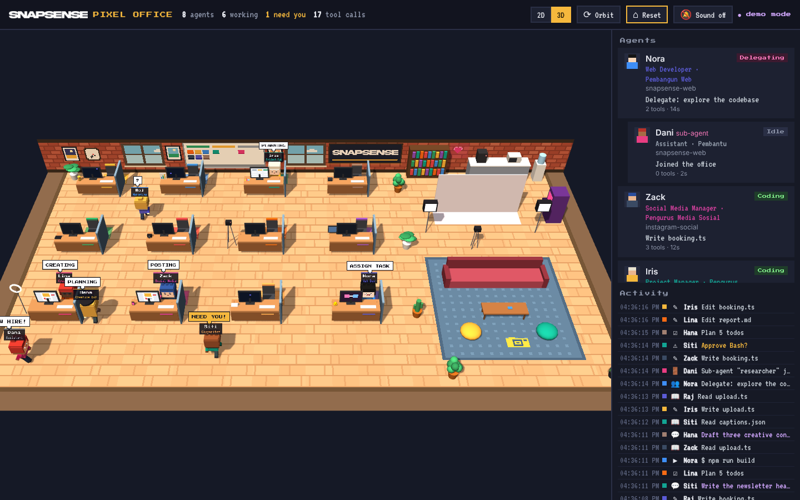

# 🏢 SnapSense Virtual Office

**Pejabat maya animasi untuk agent Claude Code anda.** Setiap sesi Claude Code jadi seorang ahli pasukan SnapSense — watak kartun dengan nama, jawatan, perangai dan emosi sendiri — yang duduk di meja, bekerja, bersembang, ketawa, stress, jatuh cinta, tertidur… dan angkat tangan bila perlukan kebenaran anda.

*A live animated virtual office for your Claude Code agents. Open source, zero dependencies, runs locally.*




---

## ✨ Ciri-ciri / Features

| | |
|---|---|
| 👔 **12 jawatan kreatif** | Creative Director, Marketing, Designer, Photographer, Videographer, Video Editor, Content Creator, Social Media, Copywriter, Web Dev dan lain-lain — setiap satu dengan meja, aksesori & skrin sendiri. |
| 🧑‍💻 **Satu sesi = satu ahli pasukan** | Setiap sesi `claude` dimainkan oleh seorang watak kartun SnapSense ikut jawatannya. |
| 🖥️ **Skrin monitor hidup** | Kod berwarna bila `Edit/Write`, terminal hijau bila `Bash`, dokumen bila `Read/Grep`, browser bila `WebSearch`. |
| ✋ **"Perlukan anda!"** | Bila Claude tunggu kebenaran, watak angkat tangan, skrin berkelip kuning, kad di panel berdenyut + bunyi chime (pilihan). |
| 👥 **Sub-agent** | Bila Claude guna `Task`/`Agent`, seorang "intern" masuk pejabat, duduk berdekatan, dan keluar bila siap. |
| ☕ **Rehat** | Agent yang idle pergi ke mesin kopi, sofa, rak buku, mesin arcade atau tingkap. |
| 📋 **Papan Kanban** | Whiteboard di dinding tunjuk sticky note setiap agent: Bekerja / Tunggu / Idle. |
| 📸 **Papan tanda SnapSense** | Logo SnapSense di dinding (flash kamera berkelip!) dan emblem pada karpet lounge — atau guna logo anda sendiri. |
| 🌗 **Siang & malam** | Tingkap & jam dinding ikut waktu sebenar anda. |
| 🎬 **Mod demo** | Agent simulasi — sesuai untuk rakam video/reels tanpa perlu Claude berjalan. |
| 🔒 **Lokal & selamat** | Hanya baca transcript (read-only), server bind ke `127.0.0.1` sahaja. Tiada data keluar dari komputer anda. |

## 👥 Pasukan / The crew

12 watak maskot, setiap seorang satu jawatan & satu meja (susunan ikut gambar pasukan):

| Nama | Jawatan | Perangai | Bila stress |
|---|---|---|---|
| **Danial** | Video Editor | chill, introvert, suka kopi & gaming | *"Jangan stress, slow2 je bro"* — mengantuk, cari kopi |
| **Lili** | Social Media | ceria, suka makan & selfie, overthinking | *"Overthink lagi..."* — sedih, lepas tu *"Jom makan!"* |
| **Haziq** | Event & Project Planner | calm, suka nature & travel | *"Tarik nafas... okay"* |
| **Sofea** | Content Creator | stylish, confident, kadang moody | *"Ugh, mood swing..."* — marah |
| **Irfan** | Marketing | energetic, suka sukan & muzik, cepat bosan | *"Jom skate jap!"* |
| **Mira** | Graphic Designer | tegas, fokus, protective | *"Siapa usik file aku?!"* |
| **Farid** | Web Dev & Research | suka ilmu, detail, pemikir | *"Kenapa tak jalan..."* |
| **Amir** | Photographer | happy go lucky, suka ketawa — tukang lawak pejabat | *"Rilek la, semua okay!"* |
| **Zul** | Videographer & Sound | tenang, jarang bercakap | *"..."* |
| **Aina** | Copywriter | sweet, penyayang, mudah tersentuh | *"Huhu... banyaknya kerja"* — menangis |
| **Hafiz** | Strategy & Client | kompetitif, disiplin | *"Fokus. Deadline."* |
| **Nadia** | HR & People | lembut, caring | datang **memujuk** rakan yang stress 💜 |

- **Sub-agent** jadi *Mini-[nama ketua]* — intern bertopi graduasi.
- **Danial ❤ Lili** — bila kedua-dua rehat, mereka duduk sebelah di sofa dengan mata hati.
- **Amir** buat lawak, kawan berdekatan ketawa terbahak-bahak.
- Rakan yang rehat bersembang sesama sendiri (bubble talk dalam Bahasa Melayu).

## 😄 Ekspresi, emosi & animasi / Emotions & animations

Setiap agent ialah watak **kartun animasi** (vektor, licin — bukan pixel) dengan muka yang berubah ikut keadaan:

| Emosi | Bila | Kesan |
|---|---|---|
| 😤 Fokus | Sedang edit / run code | Kening turun, menaip laju, zarah kod naik dari papan kekunci |
| 🤔 Berfikir | Thinking | Mata ke atas, bubble `?` |
| 🧐 Ingin tahu | Read / Search web | Mata ke bawah, progress bar |
| 😰 Risau | Perlukan kebenaran / kerja terlalu banyak | Titis peluh, bubble kuning `NEED YOU!`, tangan melambai |
| 😠 Kecewa | Tool gagal | Tanda marah merah, `OOPS!` |
| 😄 Gembira | Tugasan siap | Mata `^ ^`, pipi merah, confetti, `DONE!` |
| 🤩 Teruja | Tugasan baru / pekerja baru | `GOT IT!`, `NEW HIRE!` |
| 😴 Mengantuk | Rehat di sofa / bean bag, kerja lewat malam | `z z z` terapung, kepala terangguk |
| 😍 Bercinta | Danial & Lili, bila dipujuk | Mata hati, hati terapung |
| 😂 Kelakar | Lawak Amir | Ketawa, air mata gembira |
| 😢 Sedih / 😵 Stress | Kerja terlalu banyak | Air mata / awan conteng + menggigil |

**🔥 Overload → kebakaran:** jika agent buat **13+ tool call dalam 20 saat**, dia mula berpeluh, kemudian **komputernya terbakar** (api, asap, cahaya oren). Rakan sekerja yang sedang rehat akan datang dengan **alat pemadam api** — atau jika semua sibuk, **Bomba (Fire Marshal)** bertopi merah masuk dari pintu, sembur buih, `ALL CLEAR!` → `THANKS!` + confetti. Semua direkod dalam log aktiviti.

**👥 Kolaborasi:** anak panah animasi `ASSIGN TASK` dari agent ke sub-agent, dan `REPORT` bila sub-agent siap.

## 🧊 Mod 3D

Klik **3D** di topbar. Pejabat yang sama dalam 3D (three.js, sudah disertakan dalam `public/vendor/` — berfungsi offline). Dalam 2D pula: **scroll untuk zoom**, seret untuk pan, double-click watak untuk ikut dia.

- Seret untuk putar, scroll untuk zoom, klik watak untuk pilih
- **⟳ Orbit** — kamera berputar perlahan (sesuai untuk rakam video), **⌂ Reset** — kembali ke pandangan asal
- Skrin monitor, papan Kanban, logo, api & asap, muka watak — semuanya live
- Buka terus dalam 3D: `http://127.0.0.1:4317/#3d`

## 👔 Jawatan / Job roles

Pejabat ada **12 meja, satu untuk setiap jawatan**. Setiap jawatan ada aksesori watak, prop meja dan skrin monitor sendiri:

| Jawatan | Role | Aksesori | Prop meja | Skrin bila bekerja |
|---|---|---|---|---|
| Pengarah Kreatif | Creative Director | Beret | Trofi | Moodboard |
| Pengurus Pemasaran | Marketing Manager | Tali leher | Carta | Graf jualan |
| Pengurus Projek | Project Manager | Clipboard | Sticky notes | Kanban |
| Pengurus Akaun Pelanggan | Account Manager | Tali leher | Telefon meja | Inbox |
| Pereka Grafik | Graphic Designer | Beanie | Tablet lukisan + swatch | Canvas design |
| Jurugambar | Photographer | Kamera di leher | DSLR | Grid foto |
| Jurukamera Video | Videographer | Topi | Kamera atas tripod (REC) | Viewfinder |
| Penyunting Video | Video Editor | Headphone | Monitor kedua | Timeline video |
| Pencipta Kandungan | Content Creator | Telefon | Ring light | Feed sosial |
| Pengurus Media Sosial | Social Media Manager | Telefon | Phone stand | Feed sosial |
| Penulis Iklan | Copywriter | Cermin mata | Buku nota | Dokumen |
| Pembangun Web | Web Developer | Hoodie | Itik getah 🦆 | Kod |

**Bagaimana agent dapat jawatan:**

1. `office.config.json` — tetapkan sendiri (salin `office.config.example.json`):
   ```json
   { "roles": { "reels-2026": "video-editor", "wedding-gallery": "photographer" } }
   ```
2. Kata kunci nama folder projek — cth. `reels-editor` → Video Editor, `photo-archive` → Photographer, `brand-kit` → Graphic Designer, `ad-campaign` → Marketing Manager.
3. Jika tiada padanan → jawatan kosong pertama (Web Developer, Content Creator, Graphic Designer, …).

Sub-agent (`Task`) jadi **Assistant / Pembantu**, atau ikut jawatan jika jenisnya sepadan (cth. `designer`).

## 🔌 Live crew: TikTok, Google Calendar, Drive & tempahan

Pasukan boleh membuat kerja sebenar untuk SnapSense: statistik dan idea content TikTok, laporan engagement, tempahan dari katalog (Google Form/Sheet), kalendar dan Drive. Agent hanya **membaca dan mencadangkan**. Setiap perubahan menunggu anda klik **Approve** dalam panel *Live crew*. Panduan penuh ada dalam **[crew/SETUP.md](crew/SETUP.md)**.

## 🚀 Mula / Quick start

Perlu **Node.js 18+** sahaja. Tiada `npm install`.

```bash
git clone https://github.com/snapsenseofficial/snapsanse-virtual.git
cd snapsanse-virtual
npm start            # atau: node server.js
```

Buka **http://127.0.0.1:4317** — kemudian jalankan `claude` dalam mana-mana projek dan tengok agent anda "clock in" 🎉

Nak tengok dulu tanpa Claude? / Just want to see it?

```bash
npm run demo         # → http://127.0.0.1:4317/?demo
```

Atau buka `public/index.html` terus dalam browser — ia auto masuk mod demo.

## ⚡ Hooks (pilihan, lebih tepat) / Optional hooks

Secara default, Virtual Office membaca transcript Claude Code di `~/.claude/projects/` — tak perlu setup apa-apa. Untuk kemas kini **serta-merta** dan pengesanan **"perlukan kebenaran"** yang tepat, pasang hooks:

```bash
npm run hooks:install      # tambah hooks ke ~/.claude/settings.json (backup dibuat: settings.json.bak)
npm run hooks:uninstall    # buang semula
node bin/install-hooks.js --project   # hanya untuk projek semasa (.claude/settings.json)
```

Hook `bin/hook.js` cuma hantar JSON event ke server lokal dan **sentiasa exit 0 dalam < 1.5s**, jadi ia tidak akan ganggu Claude Code walaupun server tak berjalan.

## ⚙️ Pilihan / Options

```text
node server.js [options]
  --port <n>        Port (default 4317, atau $PORT)
  --host <addr>     Alamat bind (default 127.0.0.1 — kekalkan lokal!)
  --projects <dir>  Folder transcript (default ~/.claude/projects, ikut $CLAUDE_CONFIG_DIR)
  --no-watch        Jangan baca transcript (hooks sahaja)
  --demo            Agent simulasi
  --verbose         Log aktiviti watcher
```

Jika guna port lain dengan hooks: `export PIXEL_OFFICE_PORT=5000`.

## 🧠 Cara ia berfungsi / How it works

```
Claude Code ──► ~/.claude/projects/**/*.jsonl ──► lib/watcher.js ─┐
     │                                                             ├─► lib/state.js ──SSE──► browser (pejabat animasi 2D / 3D)
     └────────► hooks ──► bin/hook.js ──POST /hook ───────────────┘
```

| Aktiviti Claude | Status | Apa yang anda nampak |
|---|---|---|
| `Edit`, `Write`, `MultiEdit` | Coding | Menaip laju, kod berwarna di skrin |
| `Read`, `Grep`, `Glob` | Reading | Skrin dokumen dengan garisan scan |
| `Bash` | Running | Terminal hijau |
| `WebFetch`, `WebSearch`, MCP | Browsing | Skrin browser |
| `TodoWrite` | Planning | Senarai semak |
| `Task` / `Agent` | Delegating | Sub-agent masuk pejabat |
| Tunggu kebenaran | Needs you | Angkat tangan, skrin kuning berkelip, `!` |
| Giliran tamat | Idle | Pergi rehat (kopi, sofa, arcade…) |

**Tanpa hooks**, "perlukan kebenaran" diteka: jika tool pendek (bukan Bash/Task/Web) tak siap dalam 8 saat. Agent keluar pejabat selepas 30 minit tanpa aktiviti.

### Struktur projek

```
server.js            HTTP + SSE server (tiada dependency)
lib/state.js         Model agent & status, heuristik
lib/watcher.js       Tail transcript JSONL (read-only)
bin/hook.js          Penghantar hook Claude Code
bin/install-hooks.js Pasang/buang hooks
public/              Front-end: mascots.js (pasukan + dialog), roles.js (jawatan), toon.js (watak kartun + emosi),
                     scene.js (pejabat ilustrasi), world.js (simulasi + 2D), world3d.js (3D) (peta, pathfinding, render), app.js (panel), demo.js
test/                node --test
```

## 🎨 Ubah suai / Customise

- **Logo** — `public/logo.png` (logo SnapSense, PNG lutsinar). Ganti dengan logo anda sendiri; ia dipaparkan pada papan tanda dinding (2D & 3D) dan topbar. Padam fail itu untuk papan tanda teks terbina.
- **Ambang kebakaran** — `FIRE_AT`, `LOAD_WINDOW` dalam `public/world.js`
- **Watak** — `CREW` dalam `public/mascots.js` (nama, warna, pakaian, aksesori, perangai, ayat bubble talk)
- **Jawatan** — `ROLES` dalam `public/roles.js` (label, kata kunci, prop meja, skrin)
- **Susun atur pejabat** — `desks`, `plants`, `SPOTS` dalam `public/world.js` (grid 26×16, tile 16px)
- **Teks bubble** — `BUBBLE` dalam `public/world.js`

## 🎬 Tip untuk content creator

- `npm run demo`, besarkan browser ke full screen, rakam skrin → terus jadi B-roll "AI team saya sedang bekerja".
- Semua dilukis secara vektor, jadi kekal tajam bila zoom atau rakam 4K. Mod 3D + **⟳ Orbit** sesuai untuk shot sinematik.

## 🤝 Sumbangan / Contributing

PR dialu-alukan! Jalankan `npm test` sebelum hantar.

## 📄 Lesen / License

MIT © SnapSense. Inspired by the "pixel agents" trend. Not affiliated with Anthropic.
