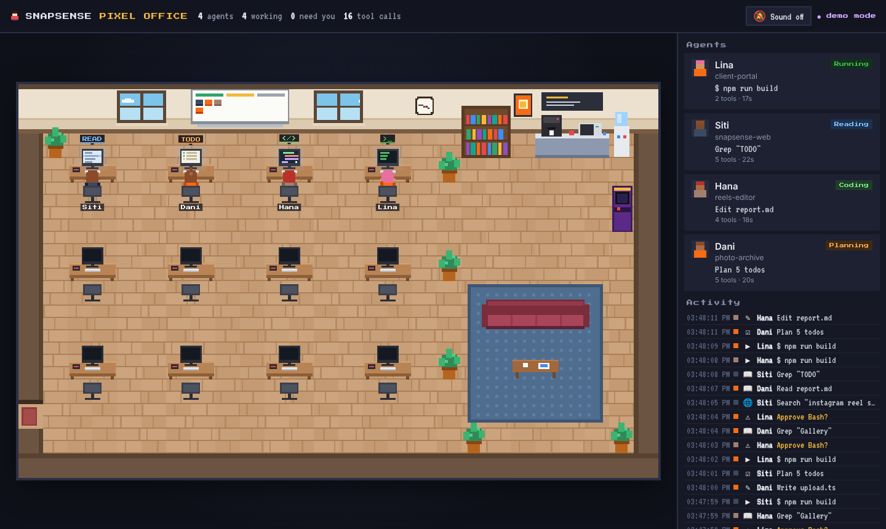

# 🏢 SnapSense Pixel Office

**Pejabat maya pixel-art untuk agent Claude Code anda.** Setiap sesi Claude Code jadi seorang "pekerja" pixel yang duduk di meja, menaip kod, membaca fail, menjalankan terminal, berehat di sofa — dan angkat tangan bila perlukan kebenaran anda.

*A live pixel-art virtual office for your Claude Code agents. Open source, zero dependencies, runs locally.*



---

## ✨ Ciri-ciri / Features

| | |
|---|---|
| 🧑‍💻 **Satu sesi = satu watak** | Setiap sesi `claude` dapat watak pixel unik (rambut, kulit, baju dijana dari ID sesi). |
| 🖥️ **Skrin monitor hidup** | Kod berwarna bila `Edit/Write`, terminal hijau bila `Bash`, dokumen bila `Read/Grep`, browser bila `WebSearch`. |
| ✋ **"Perlukan anda!"** | Bila Claude tunggu kebenaran, watak angkat tangan, skrin berkelip kuning, kad di panel berdenyut + bunyi chime (pilihan). |
| 👥 **Sub-agent** | Bila Claude guna `Task`/`Agent`, seorang "intern" masuk pejabat, duduk berdekatan, dan keluar bila siap. |
| ☕ **Rehat** | Agent yang idle pergi ke mesin kopi, sofa, rak buku, mesin arcade atau tingkap. |
| 📋 **Papan Kanban** | Whiteboard di dinding tunjuk sticky note setiap agent: Bekerja / Tunggu / Idle. |
| 🌗 **Siang & malam** | Tingkap & jam dinding ikut waktu sebenar anda. |
| 🎬 **Mod demo** | Agent simulasi — sesuai untuk rakam video/reels tanpa perlu Claude berjalan. |
| 🔒 **Lokal & selamat** | Hanya baca transcript (read-only), server bind ke `127.0.0.1` sahaja. Tiada data keluar dari komputer anda. |

## 🚀 Mula / Quick start

Perlu **Node.js 18+** sahaja. Tiada `npm install`.

```bash
git clone https://github.com/snapsenseofficial/snapsanse-virtual.git
cd snapsanse-virtual
npm start            # atau: node server.js
```

Buka **http://127.0.0.1:4317** — kemudian jalankan `claude` dalam mana-mana projek dan tengok agent anda "clock in" 🎉

Nak tengok dulu tanpa Claude? / Just want to see it?

```bash
npm run demo         # → http://127.0.0.1:4317/?demo
```

Atau buka `public/index.html` terus dalam browser — ia auto masuk mod demo.

## ⚡ Hooks (pilihan, lebih tepat) / Optional hooks

Secara default, Pixel Office membaca transcript Claude Code di `~/.claude/projects/` — tak perlu setup apa-apa. Untuk kemas kini **serta-merta** dan pengesanan **"perlukan kebenaran"** yang tepat, pasang hooks:

```bash
npm run hooks:install      # tambah hooks ke ~/.claude/settings.json (backup dibuat: settings.json.bak)
npm run hooks:uninstall    # buang semula
node bin/install-hooks.js --project   # hanya untuk projek semasa (.claude/settings.json)
```

Hook `bin/hook.js` cuma hantar JSON event ke server lokal dan **sentiasa exit 0 dalam < 1.5s**, jadi ia tidak akan ganggu Claude Code walaupun server tak berjalan.

## ⚙️ Pilihan / Options

```text
node server.js [options]
  --port <n>        Port (default 4317, atau $PORT)
  --host <addr>     Alamat bind (default 127.0.0.1 — kekalkan lokal!)
  --projects <dir>  Folder transcript (default ~/.claude/projects, ikut $CLAUDE_CONFIG_DIR)
  --no-watch        Jangan baca transcript (hooks sahaja)
  --demo            Agent simulasi
  --verbose         Log aktiviti watcher
```

Jika guna port lain dengan hooks: `export PIXEL_OFFICE_PORT=5000`.

## 🧠 Cara ia berfungsi / How it works

```
Claude Code ──► ~/.claude/projects/**/*.jsonl ──► lib/watcher.js ─┐
     │                                                             ├─► lib/state.js ──SSE──► browser (canvas pixel office)
     └────────► hooks ──► bin/hook.js ──POST /hook ───────────────┘
```

| Aktiviti Claude | Status | Apa yang anda nampak |
|---|---|---|
| `Edit`, `Write`, `MultiEdit` | Coding | Menaip laju, kod berwarna di skrin |
| `Read`, `Grep`, `Glob` | Reading | Skrin dokumen dengan garisan scan |
| `Bash` | Running | Terminal hijau |
| `WebFetch`, `WebSearch`, MCP | Browsing | Skrin browser |
| `TodoWrite` | Planning | Senarai semak |
| `Task` / `Agent` | Delegating | Sub-agent masuk pejabat |
| Tunggu kebenaran | Needs you | Angkat tangan, skrin kuning berkelip, `!` |
| Giliran tamat | Idle | Pergi rehat (kopi, sofa, arcade…) |

**Tanpa hooks**, "perlukan kebenaran" diteka: jika tool pendek (bukan Bash/Task/Web) tak siap dalam 8 saat. Agent keluar pejabat selepas 30 minit tanpa aktiviti.

### Struktur projek

```
server.js            HTTP + SSE server (tiada dependency)
lib/state.js         Model agent & status, heuristik
lib/watcher.js       Tail transcript JSONL (read-only)
bin/hook.js          Penghantar hook Claude Code
bin/install-hooks.js Pasang/buang hooks
public/              Front-end: sprites.js (watak prosedural), world.js (peta, pathfinding, render), app.js (panel), demo.js
test/                node --test
```

## 🎨 Ubah suai / Customise

- **Nama watak** — `NAMES` dalam `public/sprites.js`
- **Warna baju/rambut** — `SHIRT`, `HAIR`, `SKIN` dalam `public/sprites.js`
- **Susun atur pejabat** — `desks`, `plants`, `SPOTS` dalam `public/world.js` (grid 26×16, tile 16px)
- **Teks bubble** — `BUBBLE` dalam `public/world.js`

## 🎬 Tip untuk content creator

- `npm run demo`, besarkan browser ke full screen, rakam skrin → terus jadi B-roll "AI team saya sedang bekerja".
- Kanvas guna integer scaling + `image-rendering: pixelated`, jadi kekal tajam bila rakam 4K.

## 🤝 Sumbangan / Contributing

PR dialu-alukan! Jalankan `npm test` sebelum hantar.

## 📄 Lesen / License

MIT © SnapSense. Inspired by the "pixel agents" trend. Not affiliated with Anthropic.
